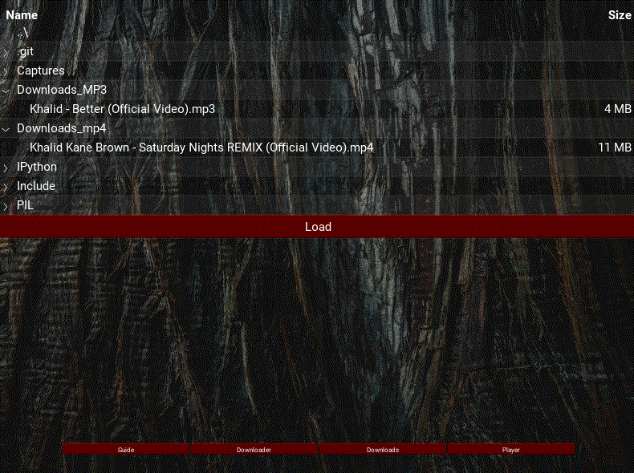

## MP4 and MP3 Youtube converter 

### Requirements:
    pip install requirements.txt
### About the app:
The app will convert youtube link into mp3 or mp4 format as shown in the downloader page: 

All downloads information are saved into local database called data.db. The user have two
options in playing the selected downloaded videos. One through generated scroll view list
with the picture of the video and the button to play:

The other  option for playing the downloads is file explorer style where the user can find the downloads in the two folders
MP3_downloads 
MP4_downloads

The app will use local player. I have tried to develop my own video player on the app but to be honset kivy video player is just not that great and buggy. 

The app also contain simple guide page. 

The navigation system is in the button to switch pages.

### Packages:
1) Desktop package: is fully completed in the Desktop_Package folder
2) Android package is under progress. Unfortunately I found that android development
with kivy is a waste of time and effort as the framework is not complete. 
But you can dig into it follow this link for more information.
Note: I recommend buildozer as the kivy emulator on android store does not work. 
 
### Using the app:

The app is aviable for use on desktop you can find the .exe file in Desktop_package/dist/YTdownloader.exe
More information about packaging: 

https://kivy.org/doc/stable/guide/packaging.html
 

